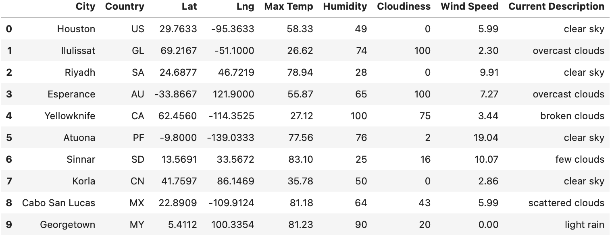
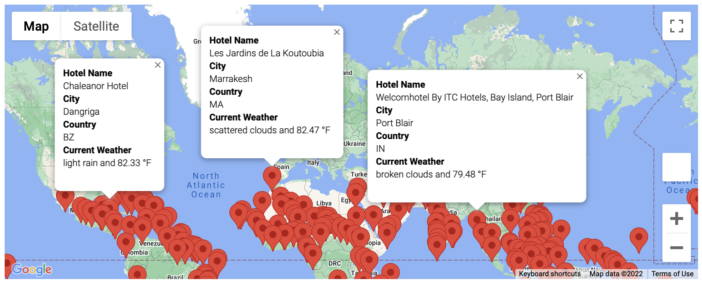
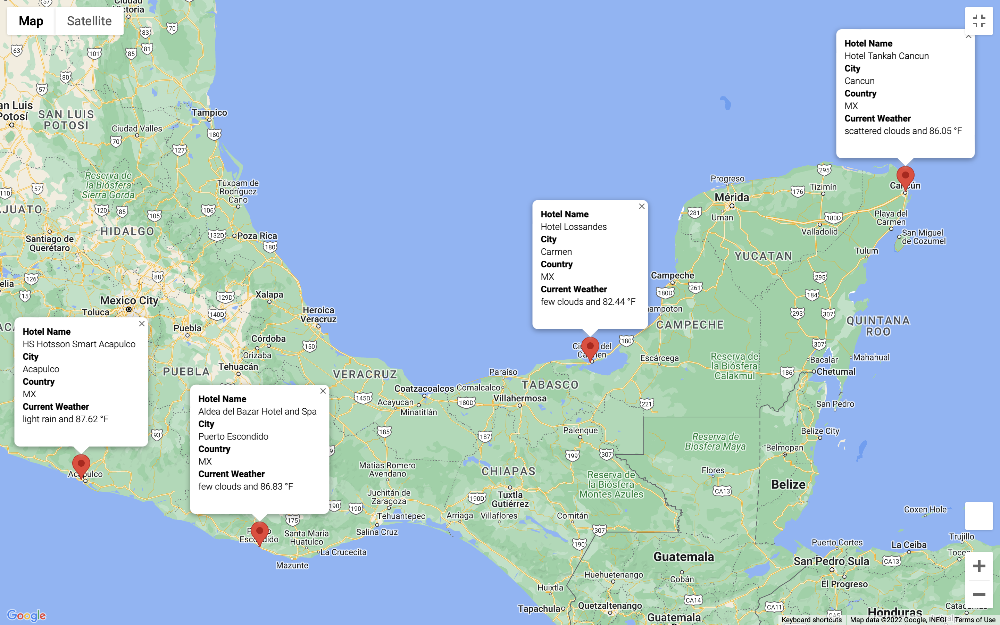
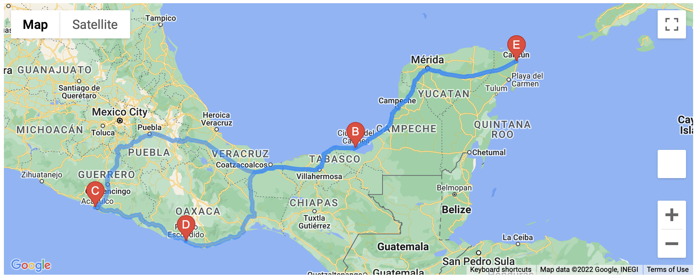

# Weather-Challenge6

Adding Open Weather API data to enhance maps labels. This allows to identify potential travel destinations and using gmaps to create a travel route between four cities and add a marker layer to find nearby hotels on the map. 

##  Retrieve weather data: 

By creating a random set if latitude/longitude and the use of citipy (python module), a list of 755 nearby cities was found. This list of cities allows to parse and retrieve weather data, such as: temperature, humidity, description, etc.  

With this complete dataset, the next step is to find a vacation destination. 

## Customer Travel Destinations Map:

Using the dataset and by means of google maps API, an interactive way to search for a destination is by temperature desired for the trip. Selecting a range from 75-90 Fahrenheit as a filter, nearby hotels for every location were found and a marker layer maps was created to visualize this findings on an interactive display. The following picture shows some of the cities found with a label box that pops up whenever the mark is clicked.

## Travel Itinerary map: 

The process to select a destination was merely by searching on the map four markers on the same country. Using some closets points that make sense for ground transportation, as seen on the picture.

With this in code, to connect the selected cities it was used the gmaps function: direction_layers. This allows to create a route on a map with diferent stops and travel mode. The following picture displays the route selected.

# This code could be applied to find your next vacation spot... Safe Travels!
